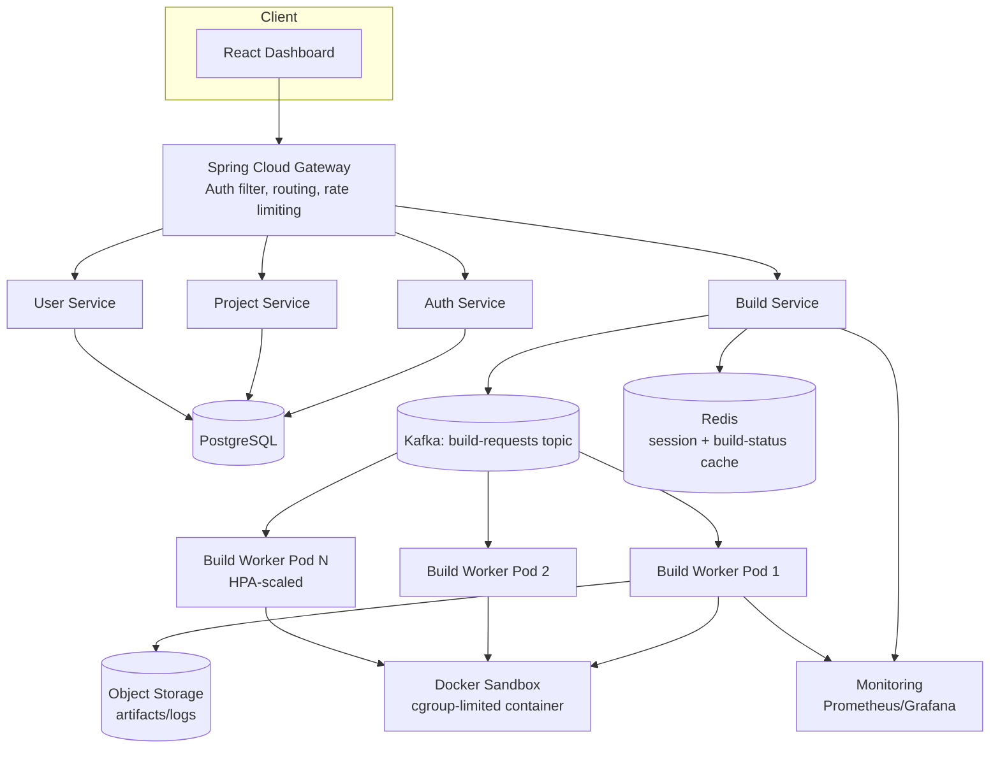
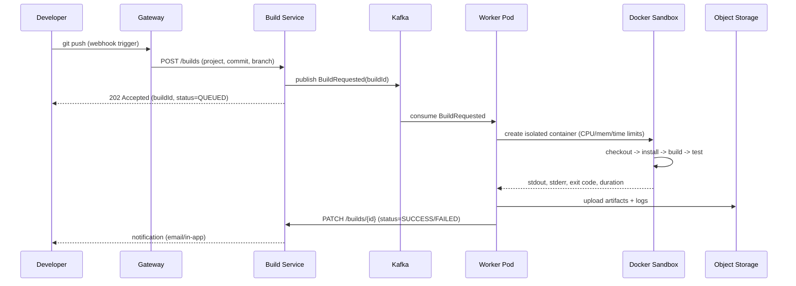
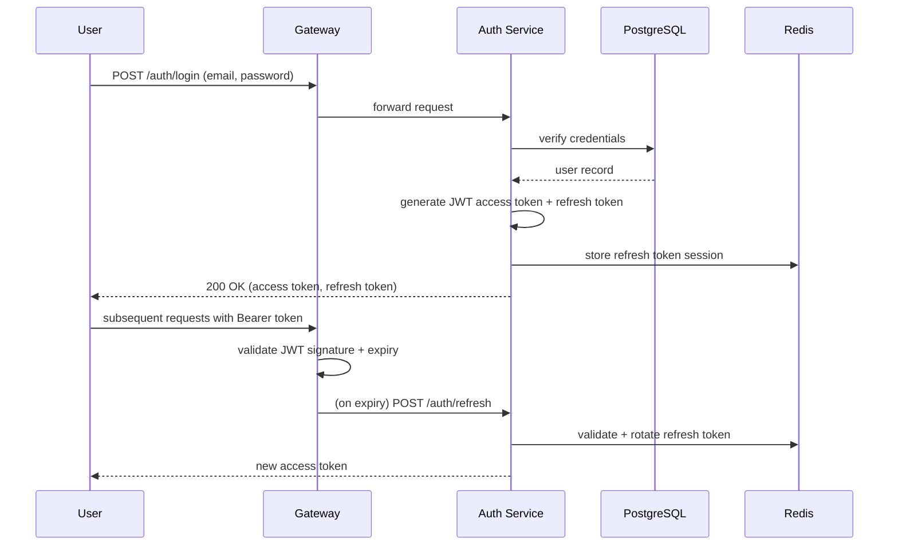
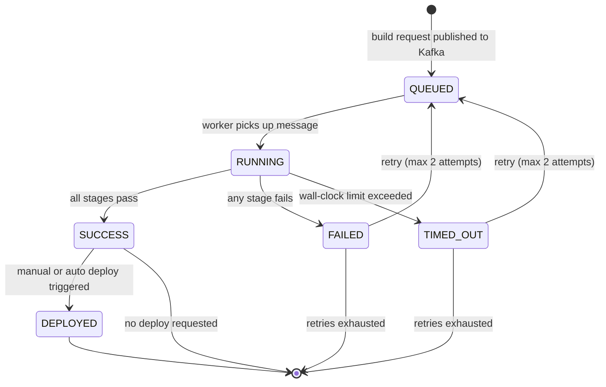
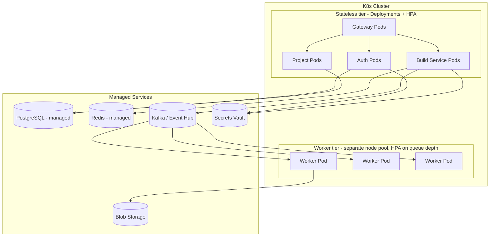
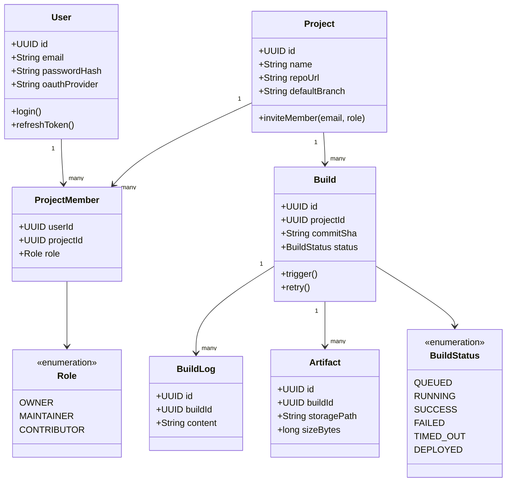
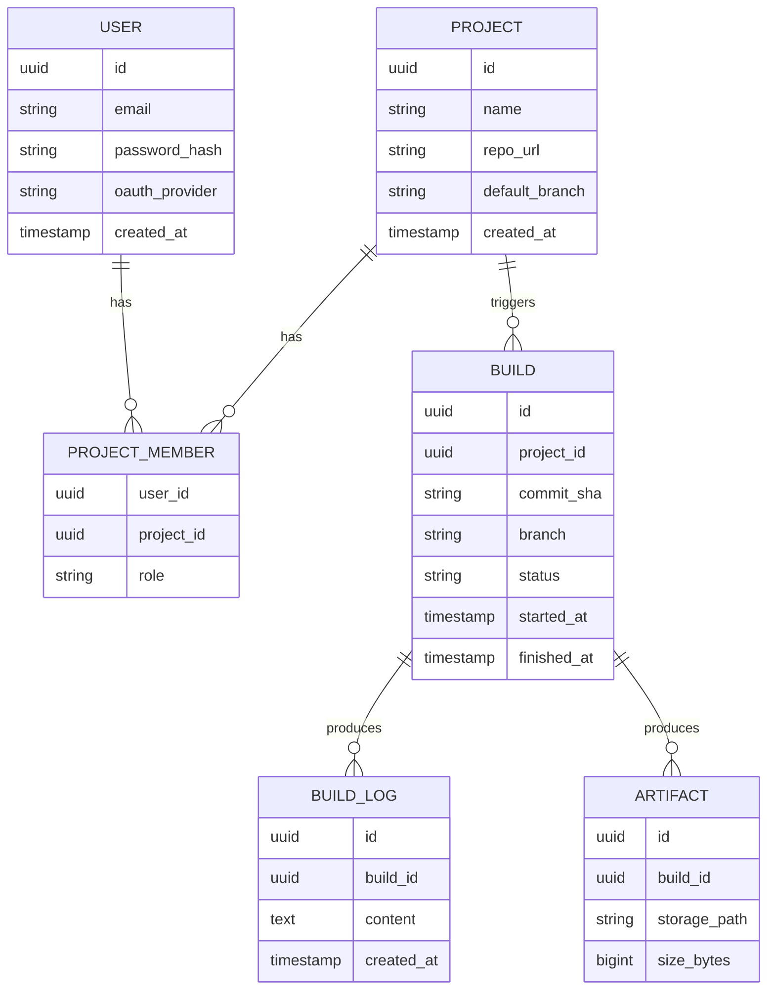
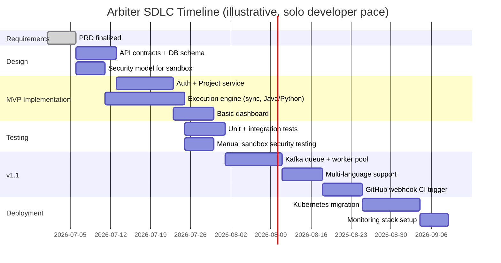

# Product Requirements Document: Arbiter
 
**Enterprise CI/CD & Secure Code Execution Platform — Complete Edition**
 
| Field | Value |
|---|---|
| Author | Shivam Bhadane |
| Version | 3.0 (Complete) |
| Status | Draft — Design Complete, Pre-Implementation |
| Last Updated | June 2026 |
 
---
 
## Table of Contents
 
1. Executive Summary
2. Problem Statement (Detailed)
3. Solution Overview
4. Goals & Non-Goals
5. Target Users & Personas
6. Competitive Landscape
7. System Architecture — All Views
   - 7.1 High-Level Component Diagram
   - 7.2 Network & Security Zone Diagram
   - 7.3 Build Execution Sequence Diagram
   - 7.4 Authentication Sequence Diagram
   - 7.5 Build Lifecycle State Diagram
   - 7.6 Deployment / Infrastructure Diagram
   - 7.7 Class Diagram (Core Domain Model)
8. Data Model (ER Diagram + Schema)
9. Tech Stack (Full, With Justification)
10. Functional Requirements
11. Non-Functional Requirements
12. API Specification (Full)
13. MVP Scope & User Stories
14. SDLC Plan & Timeline (Gantt)
15. Testing Strategy
16. Deployment Strategy & CI/CD-of-Arbiter
17. Security Model
18. Risks, Assumptions, Open Questions
19. Success Metrics
20. Future Roadmap
---
 
## 1. Executive Summary
 
Arbiter is a cloud-native platform that securely compiles, tests, executes, and deploys code inside isolated containers, combining three patterns usually solved by separate tools — CI/CD orchestration, sandboxed code execution, and lightweight team/project collaboration — into a single coherent, horizontally scalable microservices system. It is built on Java/Spring Boot, Kafka, Docker, and Kubernetes, and is designed to demonstrate distributed-systems, platform-engineering, and security-aware infrastructure skills end-to-end, from problem framing through deployment.
 
## 2. Problem Statement (Detailed)
 
**The core technical problem:** Safely executing arbitrary, untrusted code is a hard distributed-systems problem with three intersecting sub-problems:
 
1. **Isolation** — a malicious or buggy submission must not affect the host, other submissions, or other users.
2. **Resource control** — every execution needs hard CPU, memory, and wall-clock limits, enforced at the OS/container level, not just application-level timeouts.
3. **Throughput under bursty load** — execution requests arrive unevenly (a class submitting an assignment at the same time, a CI pipeline fanning out test suites), so the system must absorb bursts without starving the queue or falling over.
**Why current tools only solve part of this:**
 
| Tool | What it solves | What it doesn't |
|---|---|---|
| GitHub Actions / Azure DevOps | CI/CD orchestration | Treats execution as trusted, pre-provisioned — not built for arbitrary untrusted code |
| Judge0 / competitive judges | Sandboxed execution | No CI/CD pipeline, no team/project layer |
| Kubernetes Jobs (raw) | Scheduling, scaling | No opinionated execution-safety layer out of the box |
 
**Who feels this, concretely:**
- A solo developer who wants instant, isolated feedback on a snippet without spinning up a VM or local Docker setup.
- A small team that wants build/deploy automation without configuring or paying for a managed CI provider.
- An engineer (the author) who wants one project that proves real decision-making under real constraints — isolation, queuing, scaling — rather than a CRUD app with a database.
## 3. Solution Overview
 
Arbiter answers the problem with four cooperating capabilities, each owned by a dedicated service, connected through an event-driven core:
 
1. **Identity & Access** (Auth Service) — accounts, JWT/OAuth, RBAC.
2. **Project & Collaboration** (Project Service) — projects, repo links, invites, roles.
3. **Execution & CI/CD** (Build Service + Worker Pool) — the system's core: queue, sandbox, pipeline, deploy.
4. **Observability** (cross-cutting) — logs, metrics, build history, notifications.
The defining architectural choice is decoupling the **request-serving tier** (auth, project, dashboard reads — latency-sensitive, must stay available) from the **execution tier** (CPU/memory-bound, bursty, can fail hard) via a Kafka-based queue, so a worker pod crashing mid-build never takes down login or browsing.
 
## 4. Goals & Non-Goals
 
### Goals
1. Execute untrusted code in isolated containers with hard CPU/memory/time limits.
2. Provide a full CI/CD pipeline: push → build → test → artifact → deploy.
3. Support multi-user projects with role-based collaboration.
4. Scale horizontally under bursty build load via queue-based worker pools.
5. Be fully observable: structured logs, metrics, and end-to-end traceable build history.
### Non-Goals
- Multi-cloud parity in v1 (single cluster/cloud target).
- Real-time collaborative editing (Git-based async collaboration only).
- Billing/metering or multi-tenant SaaS commercialization.
- Universal language support (v1: a fixed, small matrix — Section 13).
## 5. Target Users & Personas
 
| Persona | Description | Primary Need | Success Moment |
|---|---|---|---|
| Solo Developer ("Dev Dana") | Builds side projects | Fast, isolated feedback without local setup | Push code, see pass/fail in under a minute |
| Team Lead ("Lead Leo") | Manages a 3–8 person project | Visibility into team build health, access control | Sees a dashboard of all recent builds across the team |
| Platform Reviewer (interviewer) | Evaluates system design | Evidence of real distributed-systems decisions | Can ask "what happens if a worker pod dies mid-build" and get a real, specific answer |
 
## 6. Competitive Landscape
 
| Product | Strength | Gap Arbiter Fills |
|---|---|---|
| GitHub Actions | Mature, huge ecosystem | Not designed for sandboxing arbitrary untrusted submissions |
| Judge0 | Purpose-built sandboxing | No project/team/CI layer |
| Replit | Great UX for instant execution | Closed-source, not a CI/CD system |
| Jenkins | Highly configurable CI | Heavyweight, dated security model for untrusted code |
 
Arbiter is not trying to out-compete any of these commercially — it exists to demonstrate the system design that sits at their intersection.
 
## 7. System Architecture — All Views
 
### 7.1 High-Level Component Diagram
 

 
### 7.2 Network & Security Zone Diagram
 
```mermaid
flowchart LR
    subgraph Public Zone
        Internet[Internet / User]
    end
    subgraph DMZ
        LB[Load Balancer / Front Door]
        GW2[API Gateway]
    end
    subgraph Trusted Internal Zone
        AUTH2[Auth Service]
        PROJ2[Project Service]
        BUILD2[Build Service]
    end
    subgraph Isolated Execution Zone - no inbound, no outbound network
        SANDBOX2[Docker Sandbox Containers]
    end
    subgraph Data Zone - private subnet only
        PG3[(PostgreSQL)]
        REDIS3[(Redis)]
        VAULT2[(Secrets Vault)]
    end
 
    Internet --> LB --> GW2
    GW2 --> AUTH2
    GW2 --> PROJ2
    GW2 --> BUILD2
    BUILD2 -->|queue only, no direct call| SANDBOX2
    AUTH2 --> PG3
    AUTH2 --> VAULT2
    BUILD2 --> REDIS3
```
 
*Key security property: the Isolated Execution Zone has no inbound or outbound network access — sandboxed code cannot reach the internet, the internal network, or the data zone, even if compromised.*
 
### 7.3 Build Execution Sequence Diagram
 

 
### 7.4 Authentication Sequence Diagram
 

 
### 7.5 Build Lifecycle State Diagram
 

 
### 7.6 Deployment / Infrastructure Diagram
 

 
### 7.7 Class Diagram (Core Domain Model)
 

 
## 8. Data Model (ER Diagram + Schema)
 

 
**Indexing notes:** `BUILD.project_id` and `BUILD.status` should be composite-indexed (queries filter by project + status constantly for dashboards). `BUILD_LOG.build_id` indexed for log retrieval. Consider partitioning `BUILD_LOG` by month once volume grows, since logs dominate storage growth.
 
## 9. Tech Stack (Full, With Justification)
 
| Layer | Technology | Why |
|---|---|---|
| Frontend | React, TypeScript | Fast iteration, strong typing, large ecosystem |
| API Gateway | Spring Cloud Gateway | Centralized auth filtering, routing, rate limiting |
| Backend services | Java 21, Spring Boot 3, Spring Security, Spring Data JPA | Mature ecosystem, strong typing, matches target-role stack (Microsoft SDE) |
| Messaging | Apache Kafka | Durable, replayable, decouples bursty execution load from request-serving tier |
| Cache/session | Redis | Sub-millisecond session/status lookups |
| Primary DB | PostgreSQL | ACID guarantees for users/projects/builds relational data |
| Object storage | Azure Blob Storage / S3-compatible | Cheap, durable storage for build artifacts and logs |
| Containers | Docker | Industry-standard sandboxing unit, cgroup-based resource limits |
| Orchestration | Kubernetes (AKS or self-managed) | Worker pool autoscaling, service deployment, self-healing |
| CI/CD of Arbiter itself | GitHub Actions | Free, ubiquitous, integrates directly with repo |
| Observability | Prometheus, Grafana / Azure Monitor | Industry-standard metrics + dashboards |
| Secrets | Azure Key Vault / HashiCorp Vault | No secrets in source or container images |
| Testing | JUnit 5, Testcontainers | Real Postgres/Kafka in integration tests, not mocks |
 
## 10. Functional Requirements
 
### 10.1 Authentication & Authorization
- FR-1: Register/login via email + password.
- FR-2: GitHub OAuth login.
- FR-3: Short-lived JWT access tokens; rotated refresh tokens.
- FR-4: Every project-scoped action checks caller's role.
### 10.2 Project Management
- FR-5: Create project, link GitHub repo.
- FR-6: Invite collaborators by email, assign roles.
- FR-7: Restrict which branches trigger automatic builds.
### 10.3 Code Execution
- FR-8: Submit a snippet (language, source, stdin) for ad-hoc sandboxed execution.
- FR-9: Each execution runs in its own container with enforced CPU/memory/time limits.
- FR-10: Results include stdout, stderr, exit code, duration, memory used.
- FR-11: v1 supports Java, Python, C++, Node.js.
### 10.4 CI/CD Pipeline
- FR-12: GitHub push webhook triggers a build automatically.
- FR-13: Pipeline stages run in order: checkout → install → build → test → package.
- FR-14: Build status reported back via GitHub commit-status API.
- FR-15: Manual deploy trigger from dashboard.
### 10.5 Build Orchestration
- FR-16: Build requests published to Kafka, consumed by worker pool.
- FR-17: Workers are stateless, scale horizontally on queue depth.
- FR-18: Failed builds retry up to 2x with exponential backoff before FAILED.
### 10.6 Observability
- FR-19: Build logs stream to dashboard during execution.
- FR-20: Full queryable build history per project.
- FR-21: Notifications (email/in-app) on build completion/failure.
## 11. Non-Functional Requirements
 
| Category | Requirement |
|---|---|
| Security | No submission accesses another submission's filesystem/network/process tree; secrets never in source/logs/images |
| Performance | Judge-mode execution returns result in <2s p95, excluding queue wait |
| Scalability | ≥50 concurrent builds without queue starvation, scaling workers horizontally |
| Availability | Dashboard/read paths degrade gracefully (queue, don't fail) if Build Service is down |
| Reliability | No silent failures — every failure state logged and surfaced |
| Observability | Every request traceable end-to-end via correlation ID |
| Maintainability | Each service independently deployable and testable |
 
## 12. API Specification (Full)
 
```
Auth
POST   /api/auth/register
POST   /api/auth/login
POST   /api/auth/refresh
GET    /api/auth/oauth/github/callback
 
Projects
POST   /api/projects
GET    /api/projects/{id}
PATCH  /api/projects/{id}
POST   /api/projects/{id}/invite
PATCH  /api/projects/{id}/members/{userId}
DELETE /api/projects/{id}/members/{userId}
 
Builds
POST   /api/projects/{id}/builds
GET    /api/builds/{id}
GET    /api/builds/{id}/logs
GET    /api/builds/{id}/artifacts
POST   /api/builds/{id}/retry
POST   /api/builds/{id}/deploy
 
Execution (judge mode)
POST   /api/execute
GET    /api/execute/{id}
 
Webhooks
POST   /api/webhooks/github
```
 
## 13. MVP Scope & User Stories
 
### In MVP
- Auth: email/password only (OAuth deferred).
- Single role per project (Owner only — RBAC granularity deferred).
- Judge-mode execution only, for **Java and Python**.
- **Synchronous execution** (no Kafka yet) — direct call to a worker; queue added once load-testing shows it's needed.
- Single PostgreSQL instance; no Redis caching layer yet.
- Manual deploy trigger only; no GitHub webhook auto-trigger.
- Logs/build history in Postgres (object storage deferred).
### Core MVP User Stories
1. *As a developer*, I can register and log in, so that my projects are private to me.
2. *As a developer*, I can submit a Java or Python snippet and get pass/fail + runtime output back within seconds.
3. *As a developer*, I can see a history of my past submissions and their results.
4. *As a developer*, my submission cannot exceed a fixed memory/CPU/time budget, and I'm told clearly if it does.
### Deferred to Post-MVP
OAuth, full RBAC, Kafka-based queueing, GitHub webhook auto-trigger, Kubernetes deployment (MVP runs as Docker Compose on a single VM), Prometheus/Grafana.
 
**Why this scope:** it proves the hardest, most distinctive part of the system — secure isolated execution with resource limits — without requiring the full distributed apparatus before anything works end-to-end. Everything deferred is a legitimate "designed, not yet built" talking point in interviews.
 
## 14. SDLC Plan & Timeline
 

 
| Phase | Activities | Output |
|---|---|---|
| 1. Requirements | This PRD; finalize MVP scope | Signed-off PRD |
| 2. Design | API contracts, DB schema, sandbox security model | API spec, diagrams (Section 7) |
| 3. MVP Implementation | Auth, Project service, sync execution engine, basic dashboard | Working MVP |
| 4. Testing | Unit (JUnit), integration (Testcontainers), manual sandbox security tests | Test suite + security report |
| 5. v1.1 Implementation | Kafka queue, multi-language, GitHub webhook | Incremental releases |
| 6. Deployment | Containerize, deploy to K8s, set up CI for Arbiter itself | Live demo environment |
| 7. Maintenance | Monitor usage, fix sandbox edge cases, add RBAC/OAuth | Ongoing |
 
## 15. Testing Strategy
 
- **Unit tests**: business logic per service (JUnit 5).
- **Integration tests**: real Postgres/Kafka via Testcontainers, not mocks, for critical paths.
- **Security tests (manual, documented)**: attempt fork bombs, network calls from inside the sandbox, host-filesystem reads — document the mitigation for each attempted escape.
- **Load tests**: simulate concurrent submissions to validate the ≥50-concurrent-builds NFR before claiming it anywhere.
## 16. Deployment Strategy & CI/CD-of-Arbiter
 
- MVP: Docker Compose on a single VM — cheap, fast to demo.
- v1.1: Move worker tier to Kubernetes with HPA once the queue-based architecture exists; keep auth/project services on simpler infra until load justifies the move.
- CI/CD for Arbiter itself: GitHub Actions runs tests on every PR; manual approval gate before deploying to the demo environment.
## 17. Security Model
 
- **Container isolation**: each execution gets its own container, no shared filesystem or process namespace with other executions.
- **Resource limits**: cgroup-enforced CPU shares, memory ceiling, and wall-clock timeout per execution.
- **Network isolation**: execution containers have no inbound or outbound network access (Section 7.2).
- **Secrets management**: all credentials in a vault, injected at runtime, never baked into images or committed to source.
- **Least privilege**: worker pods run with a minimal service account, no access to the data zone beyond what's explicitly needed (object storage write, status callback).
- **Known limitation**: Docker-based isolation alone is weaker than gVisor/Firecracker-style microVM isolation. Stated explicitly as an accepted trade-off for a portfolio-scale system, not implied as production-grade for a multi-tenant commercial product.
## 18. Risks, Assumptions, Open Questions
 
| Item | Type | Notes |
|---|---|---|
| Docker isolation weaker than microVM isolation | Risk | Acceptable trade-off for project scope; state explicitly |
| Solo-developer bandwidth vs. full architecture | Risk | Mitigated by MVP-first scoping (Section 13) |
| Kafka may be over-engineering before real load exists | Assumption to validate | Defer until queue starvation is observed in load tests |
| Always-on vs. on-demand demo environment | Open question | Decide before interviews; explained cold-start is fine, a broken link is not |
 
## 19. Success Metrics
 
- MVP functional: user can sign up, submit code, get correct pass/fail with enforced limits.
- p95 judge-mode execution <2s under ≥10 concurrent submissions.
- Zero sandbox escape across documented manual security tests.
- At least one real end-to-end CI/CD run (push → build → test → deploy) once v1.1 lands.
## 20. Future Roadmap
 
1. OAuth + full RBAC.
2. Kafka-based async queue + horizontally scaled worker pool.
3. GitHub webhook-triggered CI/CD with commit-status reporting.
4. Kubernetes deployment with HPA on queue depth.
5. Prometheus/Grafana observability stack.
6. Expand language matrix (C, Go, Rust).
7. Slack/Teams notification integration.
8. Sandbox upgrade path to gVisor or Firecracker for stronger isolation guarantees.

